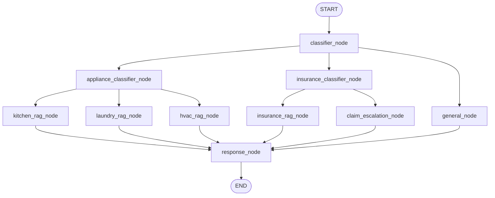

# nested-conditional-home-assistant

A LangGraph pipeline for a home assistant that routes a homeowner's
question through two layers of classification instead of one, so the
system narrows down step by step — top-level category first, then a
more specific subtype — before retrieving the right context and
answering.

## Business context

Same home assistant concept, but now with two decision layers instead
of one — because a single classification is often too coarse. A
question tagged "appliance" could be about a kitchen appliance,
laundry machine, or HVAC system, and each needs a different manual. A
question tagged "insurance" could be a coverage question
(informational) or an active claim (needs a different, more careful
response tone). Nesting the routing means the system narrows down step
by step instead of guessing everything in one shot.

## Pipeline design

**Graph input (`START`):** the conversation so far (`messages`) plus
`household_type` (apartment / house / rental). The latest human message
is what gets classified at each routing step.

**Graph output (`END`):** one AI message appended to `messages`,
generated after the query has been routed to the correct branch,
context retrieved, and (for active insurance claims) an escalation
flag applied to adjust response tone.

The graph has two levels of routing. Level 1 splits into three
top-level categories (`appliance`, `insurance`, `general`). Two of
those three — `appliance` and `insurance` — have a second classifier
that narrows further before retrieval happens. All branches converge
on a single `response_node` before `END`.

### Shared State

- `messages` — conversation history
- `household_type` — apartment / house / rental
- `query_type` — level-1 classification: `appliance`, `insurance`, or `general`
- `appliance_subtype` — level-2 classification (only set if appliance): `kitchen`, `laundry`, `hvac`
- `insurance_subtype` — level-2 classification (only set if insurance): `coverage_question`, `active_claim`
- `retrieved_context` — pulled document chunks or marker

### Classification (1 node + router)

1. **classifier_node** — decides the top-level category.
   - **In:** the homeowner's latest message.
   - **Out:** the query's top-level type — one of appliance, insurance,
     or general.

**Router `route_level1`**
- `appliance` → `appliance_classifier_node`
- `insurance` → `insurance_classifier_node`
- `general` → `general_node`

### Branch 1 — Appliance (3 nodes + classifier + router)

Only runs if `query_type == "appliance"`.

1. **appliance_classifier_node** — narrows down which appliance
   manual applies.
   - **In:** the homeowner's latest message.
   - **Out:** the appliance subtype — one of kitchen, laundry, or
     hvac.
2. **kitchen_rag_node** — retrieves from kitchen appliance manuals
   (fridge, oven, dishwasher).
   - **In:** the homeowner's latest message.
   - **Out:** retrieved passages, stored as the context to answer
     from.
3. **laundry_rag_node** — retrieves from washer/dryer manuals.
   - **In:** the homeowner's latest message.
   - **Out:** retrieved passages, stored as the context to answer
     from.
4. **hvac_rag_node** — retrieves from the HVAC system manual.
   - **In:** the homeowner's latest message.
   - **Out:** retrieved passages, stored as the context to answer
     from.

**Router `route_appliance`**
- `kitchen` → `kitchen_rag_node`
- `laundry` → `laundry_rag_node`
- `hvac` → `hvac_rag_node`

### Branch 2 — Insurance (2 nodes + classifier + router)

Only runs if `query_type == "insurance"`.

1. **insurance_classifier_node** — determines if this is a general
   coverage question or an active claim situation, since these need
   very different response handling.
   - **In:** the homeowner's latest message.
   - **Out:** the insurance subtype — coverage_question (asking what's
     covered) or active_claim (something already happened and needs
     to be filed or tracked).
2. **insurance_rag_node** — retrieves relevant policy passages for an
   informational answer.
   - **In:** the homeowner's latest message.
   - **Out:** retrieved passages, stored as the context to answer
     from.
3. **claim_escalation_node** — retrieves the same kind of policy
   passages, and additionally marks the conversation as needing
   careful, step-by-step claim-filing guidance rather than a
   conversational answer.
   - **In:** the homeowner's latest message.
   - **Out:** retrieved passages, stored as the context to answer
     from, plus a flag marking the conversation as needing claim
     guidance.

**Router `route_insurance`**
- `coverage_question` → `insurance_rag_node`
- `active_claim` → `claim_escalation_node`

### Branch 3 — General (1 node)

Only runs if `query_type == "general"`.

1. **general_node** — does no retrieval; the model answers from its
   own general knowledge.
   - **In:** the homeowner's latest message.
   - **Out:** the context field set to a marker showing no retrieval
     was needed.

### Convergence (1 node)

1. **response_node** — generates the final answer.
   - **In:** the retrieved context (or the no-retrieval marker), the
     household type, and the claim-guidance flag if set.
   - **Out:** the final AI message, appended to the conversation. If
     the claim-guidance flag is set, the answer uses a careful,
     step-by-step tone instead of a conversational one.

## Retrieval

Each RAG node (`kitchen_rag_node`, `laundry_rag_node`, `hvac_rag_node`,
`insurance_rag_node`, `claim_escalation_node`) retrieves from its own
source document through the same pipeline:

- **Embedding model:** `sentence-transformers/all-MiniLM-L6-v2` via
  `HuggingFaceEmbeddings`.
- **Vector store:** FAISS, one index built per source document
  (kitchen manual, laundry manual, HVAC manual, insurance policy doc —
  four indexes total; `insurance_rag_node` and `claim_escalation_node`
  share the same policy index).
- **Chunking:** `RecursiveCharacterTextSplitter`, chunk size 800,
  chunk overlap 100.
- **Retriever `k`:** 4 chunks returned per query.

**Source documents** live under `data/manuals/`:

- `data/manuals/kitchen.pdf`
- `data/manuals/laundry.pdf`
- `data/manuals/hvac.pdf`
- `data/manuals/policy.pdf`

These paths, along with chunk size/overlap and `k`, are configurable
values in `app/config.py`, not hardcoded in node code.



## Graph input

```python
initial_state = {
    "household_type": "house",
    "messages": [("human", "My dryer stopped heating up, what should I check?")]
}
final_state = app.invoke(initial_state)
```

## Graph output (`final_state["messages"][-1]`)

```python
("ai", "For a house resident: a dryer that runs but doesn't heat is usually caused by a tripped thermal fuse, a clogged lint vent restricting airflow, or a faulty heating element. Start by checking and cleaning the lint trap and exhaust vent, then check the thermal fuse per your model's manual — if it's blown, it needs replacing before the dryer will heat again.")
```

## Status

- [x] Project scaffolding (`pyproject.toml`, `.python-version`, `.gitignore`)
- [x] `.env` / `.env.example` — API key configuration
- [x] `app/config.py` — settings loaded via `pydantic-settings`; also holds the file paths for each of the six retrieval sources (kitchen/laundry/hvac manuals, insurance policy doc) instead of hardcoding them in node code
- [x] `app/loaders.py` — loads each source document, splits it with `RecursiveCharacterTextSplitter` (chunk size 800, overlap 100), embeds chunks with `sentence-transformers/all-MiniLM-L6-v2` via `HuggingFaceEmbeddings`, builds a FAISS index, and returns a retriever with `k=4` — one retriever per document, values sourced from `app/config.py` (see [Retrieval](#retrieval))
- [x] `app/state.py` — shared graph state model
- [ ] `app/nodes/classifier.py` — level-1 classifier node, using structured output (not string-contains parsing) so a bad parse can't cascade into the wrong level-2 classifier
- [ ] `app/nodes/appliance.py` — appliance classifier + kitchen/laundry/hvac RAG nodes, each calling `app/loaders.py` for its own retriever
- [ ] `app/nodes/insurance.py` — insurance classifier + coverage/claim-escalation RAG nodes (the latter also sets `needs_claim_guidance`), both calling `app/loaders.py` for the shared policy retriever
- [ ] `app/nodes/general.py` — general node
- [ ] `app/nodes/response.py` — final response node
- [ ] `app/graph.py` — builds and compiles the nested-conditional `StateGraph`
- [ ] `app/main.py` — non-interactive entrypoint (`python -m app.main <input>`), not a blocking CLI `input()` loop
- [ ] `sample_data/` / `sample_output/` — sample manuals/policy docs and pre-generated results covering each of the six leaf branches
- [ ] `main.py` — currently a placeholder ("Hello from nested-conditional-home-assistant!"), not yet wired to the graph

## Setup

Requires Python 3.13+ and [uv](https://docs.astral.sh/uv/).

```bash
uv sync
cp .env.example .env
# then fill in your API key in .env
```

## Run

```bash
uv run python -m app.main
```

Each run appends the AI response to the conversation state and prints
or persists the final state, following the same convention as the
`recipe-parallel-graph` project.
